# Delulu Beats

Nine free browser games that test your ear, your sense of timing and your memory, plus Beat Lab, a small studio for building a loop. Made for anyone with headphones and a minute to spare.

**Play it at [delulubeats.com](https://delulubeats.com/)** — free, no account needed, installable, and it works offline.

[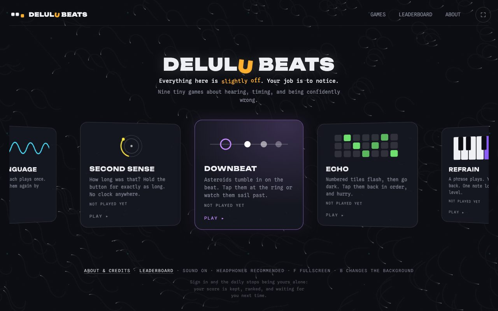](https://delulubeats.com/)

[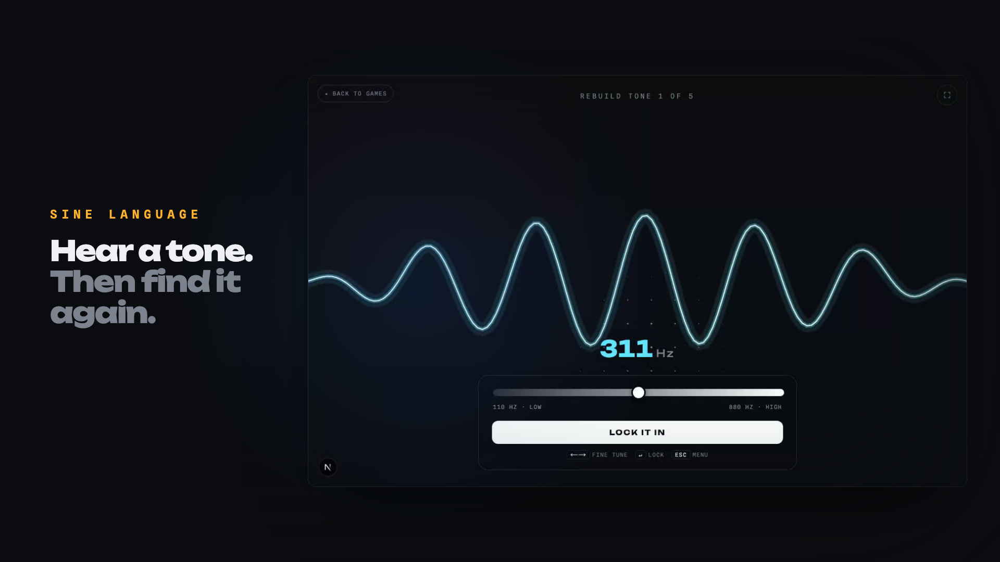](brag-output/brag.mp4)

Launch video: [landscape](brag-output/brag.mp4) · [vertical](brag-output/brag-vertical.mp4)

## The games

Each one shows or plays you something, takes it away, and asks you to rebuild it.

| Game | Tests | What you do |
| --- | --- | --- |
| [Afterimage](https://delulubeats.com/color/) | Color memory | See five colors one at a time, then rebuild each one with hue, saturation and lightness sliders |
| [Sine Language](https://delulubeats.com/sound/) | Pitch memory | Hear five tones, then find each one again on a frequency slider |
| [Second Sense](https://delulubeats.com/time/) | Time perception | Feel a duration, then hold a button for exactly as long, with no clock |
| [Downbeat](https://delulubeats.com/tempo/) | Rhythm | Tap incoming notes (kicks and snares) as they reach the ring, on the beat |
| [Echo](https://delulubeats.com/memory/) | Spatial memory | Numbered tiles flash, then go dark; tap them back in order before time runs out |
| [Refrain](https://delulubeats.com/piano/) | Melody memory | Play back a piano phrase that grows by one note each level |
| [Fever Dream](https://delulubeats.com/fever/) | Beat memory | Watch a microwave keep time for two bars, then carry the pulse alone with eight taps |
| [Phantom Drop](https://delulubeats.com/phantom/) | Internal timing | The beat cuts out before the drop; count through the silence and tap the 1 |
| [Off-Grid](https://delulubeats.com/offgrid/) | Microtiming | One hit in an eight-hit drum loop is late; find it as the delay shrinks each round |

<table>
  <tr>
    <td><a href="https://delulubeats.com/color/">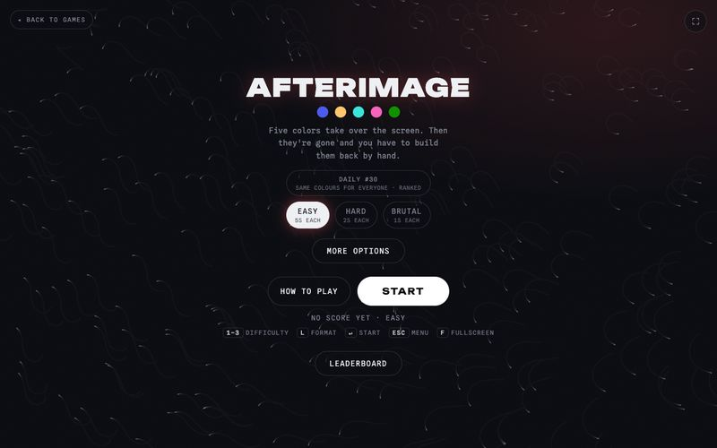</a></td>
    <td><a href="https://delulubeats.com/sound/">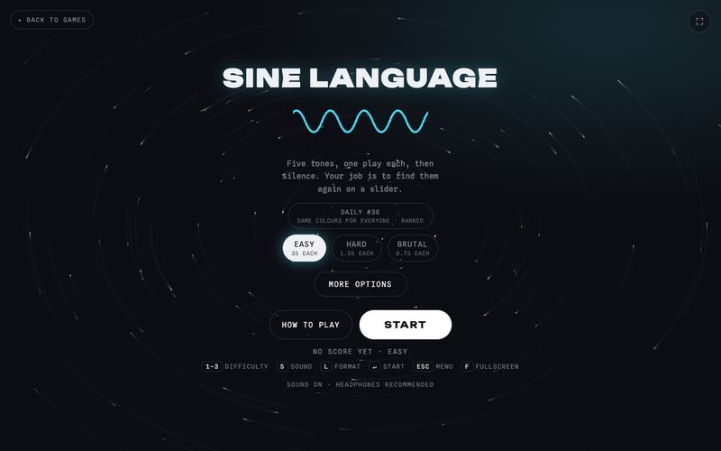</a></td>
    <td><a href="https://delulubeats.com/time/">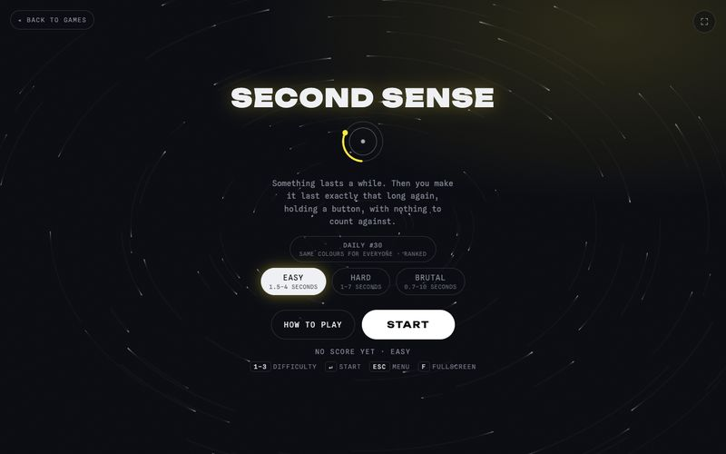</a></td>
  </tr>
  <tr>
    <td><a href="https://delulubeats.com/tempo/">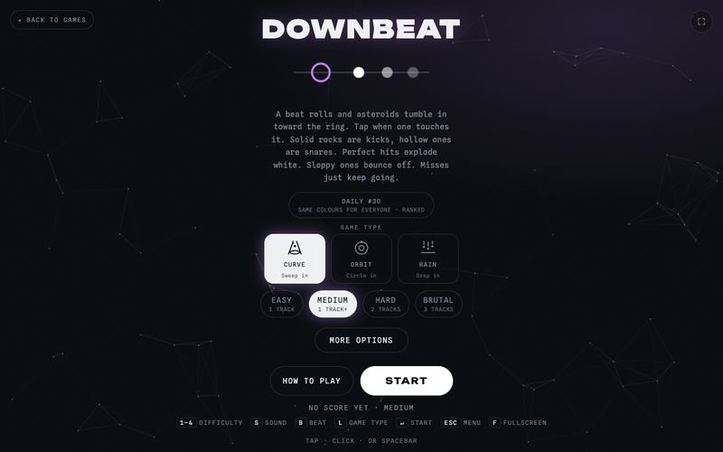</a></td>
    <td><a href="https://delulubeats.com/memory/">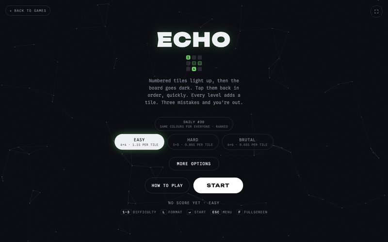</a></td>
    <td><a href="https://delulubeats.com/piano/">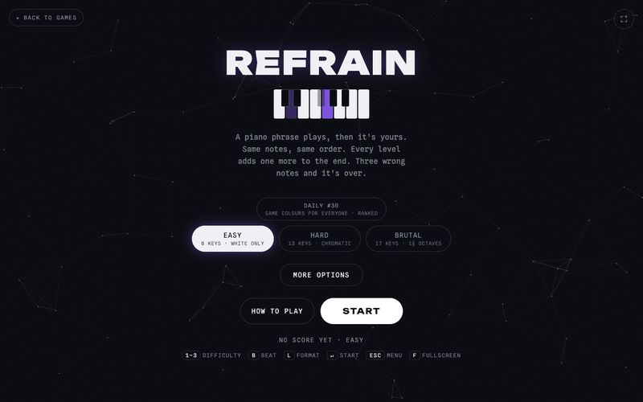</a></td>
  </tr>
  <tr>
    <td><a href="https://delulubeats.com/fever/">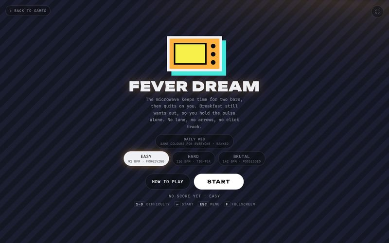</a></td>
    <td><a href="https://delulubeats.com/phantom/">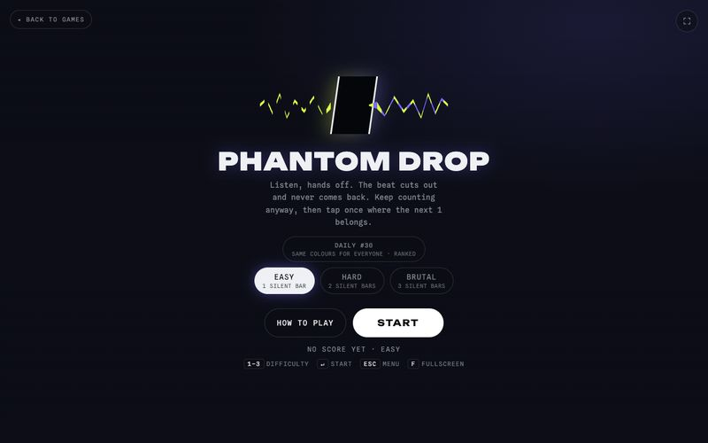</a></td>
    <td><a href="https://delulubeats.com/offgrid/">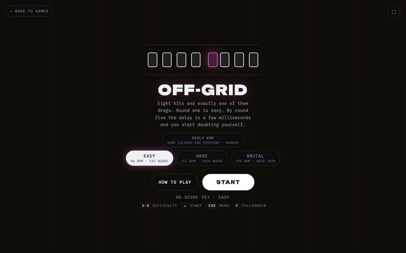</a></td>
  </tr>
</table>

In play — Downbeat and Echo:

<p>
  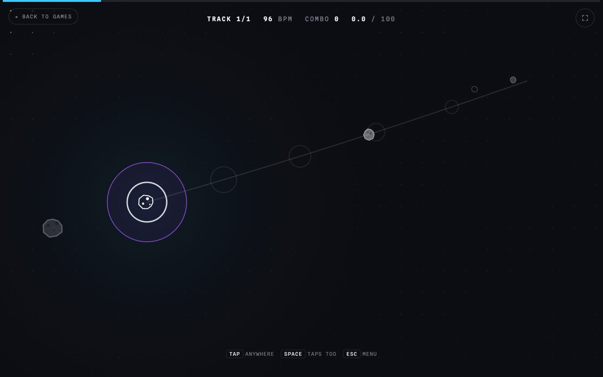
  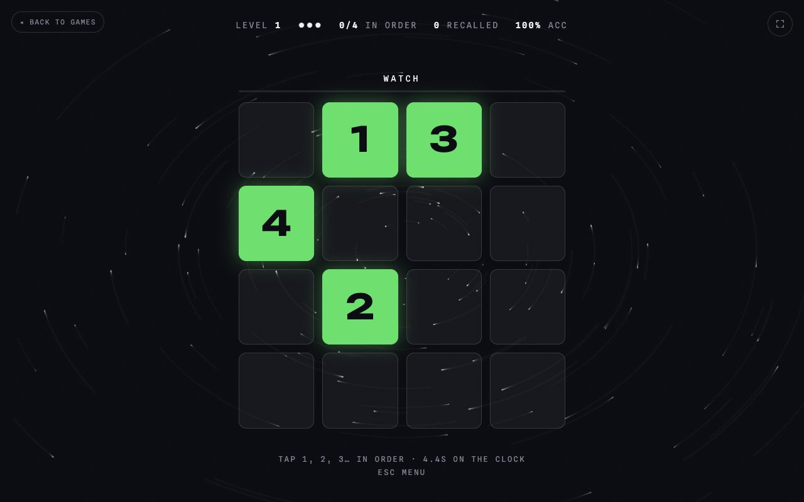
</p>

### Options in every game

- **Free Play** or a seeded **Daily** challenge that is the same for everyone at each difficulty
- Easy, Hard and Brutal difficulty (Downbeat adds Medium)
- Per-game variations: recall one at a time or all five first (Afterimage, Sine Language); Warm, Pure, Organ and Chip tones (Sine Language); Punch, Boom, Club and Wood drum kits and Curve, Orbit and Rain lanes (Downbeat); Flash and Trail reveals (Echo); Watch or By ear (Refrain)
- Mouse, keyboard and touch input, with shortcuts shown on screen (`Enter` start, `Esc` menu, `F` fullscreen, number keys for difficulty)
- Best scores, play counts and daily streaks saved in the browser
- Share cards with native sharing, clipboard copy or WhatsApp

## Beat Lab

[Beat Lab](https://delulubeats.com/studio/) is a step-sequencer studio. Pick Rap / Hip-Hop, R&B or House, a key and a tempo, then stack drums, bass, chords, melody and vocal chops. Everything stays in key, including parts picked by **Surprise me**. Press **Download** to save the loop as an audio file.

[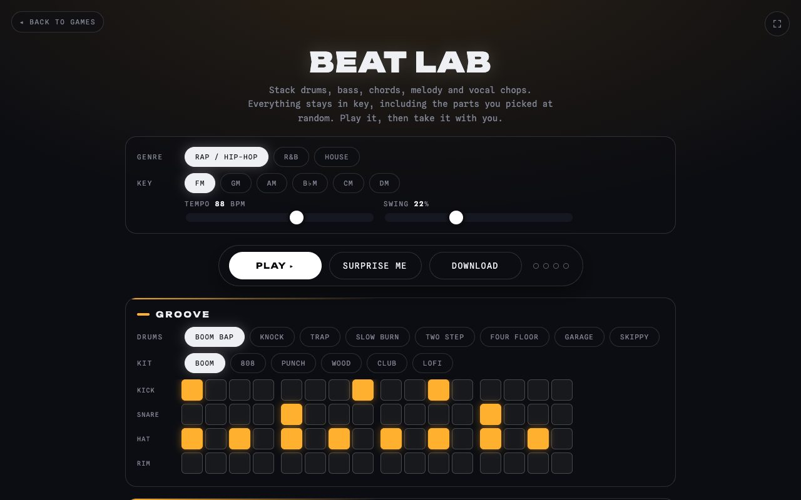](https://delulubeats.com/studio/)

## Daily leaderboard

Sign in with Google to post your Daily scores to the [leaderboard](https://delulubeats.com/leaderboard/), under a name you choose. Only the Daily is ranked, and scores are rechecked on the server. The same board also ranks [Shut The Cube](https://shutthecube.com). Every game plays in full without signing in.

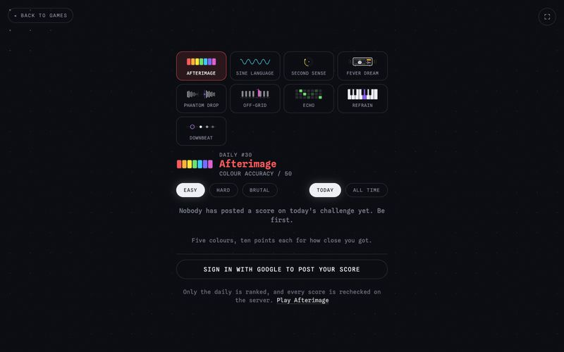

## On your phone

The site is a progressive web app: add it to your home screen and every game and drum kit is cached, so it plays with no connection.

<p>
  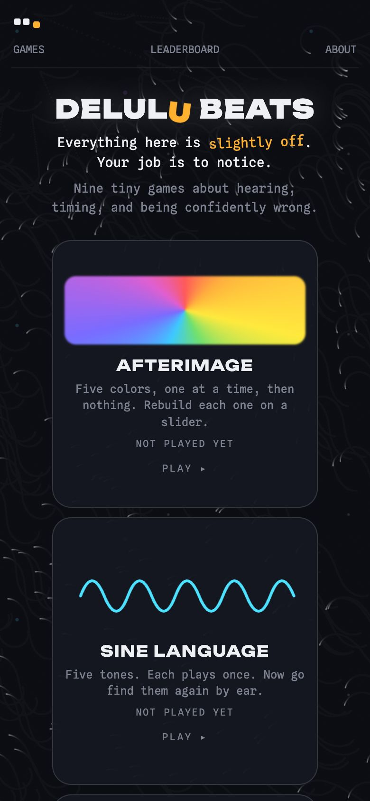
  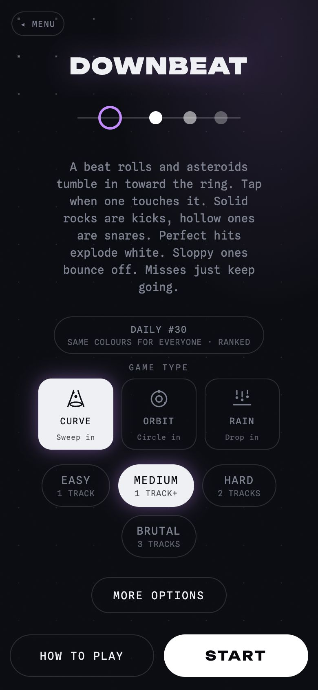
  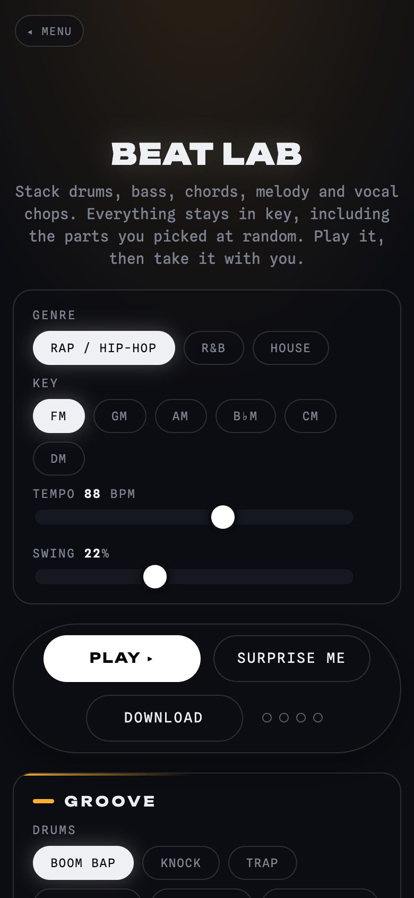
</p>

## How it works

- Fully static: Next.js builds to plain files, deployed to GitHub Pages on every push to `main`.
- Sound runs on the Web Audio API: synthesized tones and effects, plus sampled drum kits with a synthesized fallback.
- Scoring and visuals are timed against the audio clock (`AudioContext.currentTime`), not timers, so what you hear and what you are scored on stay in sync.
- A hand-written service worker (`public/sw.js`) handles offline play; there is no build plugin.
- The leaderboard and sign-in use a separate shared API; the games themselves need no server.

## Tech stack

Next.js (App Router, static export), React, TypeScript, [Motion](https://motion.dev), Web Audio API, Canvas.

## Run locally

Requires Node.js 20.

```bash
npm install
npm run dev          # http://localhost:3000
npm run lint
npm run build        # static export to out/
npm run test:audio   # checks listening games don't play what you're meant to hear (needs Chrome and a running dev server)
```

Other scripts: `npm run social` (share images), `npm run icons` (app icons). Both also run before every build and their output is committed.

The service worker is not registered in development. To test offline mode, build and serve `out/` (for example `npx serve out`).

Optional environment variables: `NEXT_PUBLIC_ARCADE_API` (leaderboard API base URL) and `PAGES_BASE_PATH` (serve from a sub-path).

## Project structure

```
src/app/         one folder per game (color, sound, time, tempo, memory, piano, fever, phantom, offgrid),
                 plus studio (Beat Lab), leaderboard, about
src/components/  shared UI: game setup, sound gate, share card, leaderboard, install prompt
src/lib/         audio engine, storage, daily challenges, leaderboard client
public/          service worker, drum samples, icons, share images
scripts/         asset generators and the audio test
```

## Credits

Made by Oliver Saly and his dad, Victor Saly. Inspired by playful browser experiments such as [Neal.fun](https://neal.fun/) and [dialed.gg](https://dialed.gg/); Delulu Beats is independent and not affiliated with either.

Made by [Victor Saly](https://victorsaly.com).
